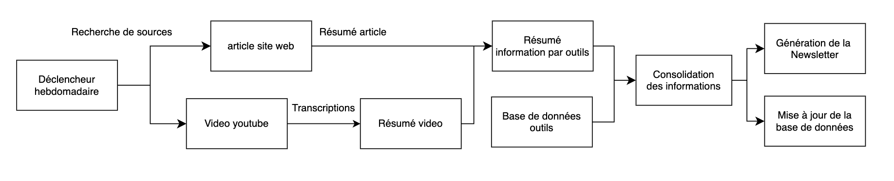
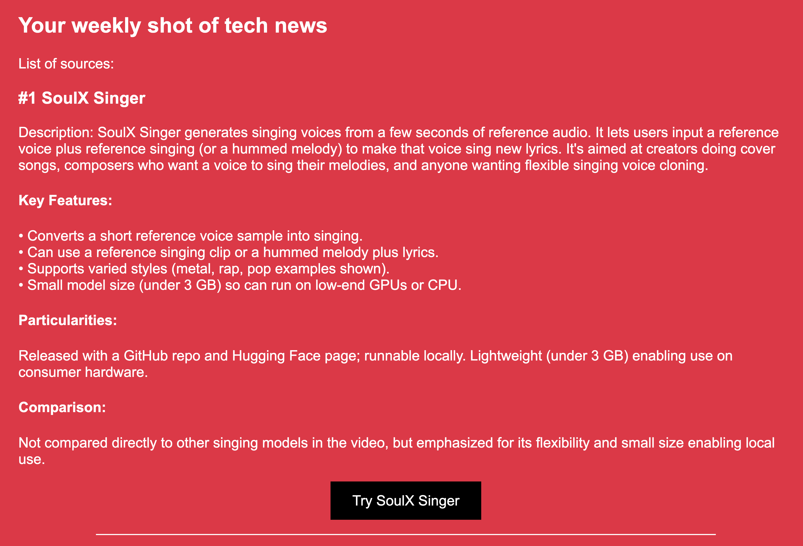

# Agent d'automatisation de veille technologique IA

Cet agent automatise une veille hebdomadaire sur les nouvelles sorties d’outils et de modèles d’IA générative. Pour cela, il s’appuie sur une sélection de sources dont il extrait et regroupe les informations afin de rédiger une description pour chaque outil présenté. De plus, une base de données contenant les informations des semaines précédentes est utilisée afin de s'assurer de la nouveautés des éléments présents dans la newletters, puis cette base se met elle-même à jour. Enfin, l’agent génère une newsletter à partir de ces descriptions retravaillées dans un format html controlé et l’envoie à une liste d’adresses e-mail.

---

## Fonctionnalités

- Collecte automatisée d’informations (RSS + YouTube)
- Extraction et structuration des information vouluvia LLM (GPT-5-mini sur Azure)
- Déduplication et enrichissement via base de données
- Historisation des outils (Azure Search)
- Génération automatique de newsletter HTML
- Envoi automatisé via Gmail

---

## Fonctionnement

### 1. Gestion des sources

Deux types de sources sont exploités :

#### Sites web et blogs
- Lecture des flux RSS
- Extraction du champ contenant les articles

#### Chaînes YouTube (IA)
- Utilisation de **YouTube Data API** :
  - Récupération des vidéos publiées dans la semaine
  - Extraction des descriptions (contenant les liens d’outils explorés)
- Récupération des **transcriptions** via une API externe (RapidAPI)

---

### 2. Traitement des données

- Données d’entrée : articles + transcriptions
- Traitement via un LLM :
  - Extraction des outils mentionnés
  - Structuration des informations :
    - Nom
    - Description
    - Caractéristiques principales
    - Éléments différenciants
    - Comparaisons
    - Lien

Modèle utilisé : **GPT-5-mini (Azure OpenAI)**

---

### 3. Regroupement des informations par outil

- Fusion des descriptions concernant un même outil
- Traitement en plusieurs passes pour :
  - éviter les limites de tokens par requête
  - préserver la qualité des informations

---

### 4. Déduplication et mise à jour

- Comparaison des descriptions d'outils avec une base de données **Azure Search**
- Objectifs :
  - éviter les redites dans les newsletters
  - enrichir les fiches des outils existantes
- Ajout des nouveaux outils et mises à jour de la base de données

---

### 5. Génération de la newsletter

- Génération d’une newsletter en **HTML**
- Structuration automatique via LLM
- Injection de la date du jour
- Envoi via **Gmail** à une liste de destinataires

---

## Architecture

---

## Exemple de newsletter

[newsletter complète](https://raw.githubusercontent.com/thaid27/agent_veille_tech_N8N/main/assets/newsletter_example.html)

---

## Valeur ajoutée

### Gain de temps
Automatisation complète d’une veille hebdomadaire (plusieurs heures à environ 15 minutes)

### Qualité de la recherche
- Sources sélectionnées et fiables
- Extraction structurée des éléments ciblés 

### Continuité
- Base de données pouvant services de bases pour d'autres services (ex: RAG)
- Mise à jour des outils existants hebdimadaires assurant la pertinance des informations
- Aucune redondance dans les newsletters pour conserver l'intérêt des lecteurs

---

## Reproduction

### Prérequis

**API et comptes :**
- Azure OpenAI
- Azure Search
- YouTube Data API
- RapidAPI
- Gmail

### Configuration

1. Importer le workflow n8n
2. Ajouter les credentials :
   - API keys
   - endpoints
3. Configurer :
   - les sources (RSS / YouTube)
   - les prompts LLM
   - le template HTML de la newsletter
4. Définir la liste des destinataires
5. Connecter Gmail

---

## Personnalisation

- Modifier les sources pour changer le domaine de veille technologique
- Adapter les prompts LLM pour ajuster les informations extraites
- Modifier le template HTML pour personnaliser le visuel

---

## Stack technique

- **n8n** (workflow agentique)
- **Azure OpenAI (GPT-5-mini)** (LLM et cloud)
- **Azure Cognitive Search** (base de données et Cloud)
- **YouTube Data API** (webscrapping)
- **RapidAPI** (webscrapping)
- **Gmail** (distribution)
